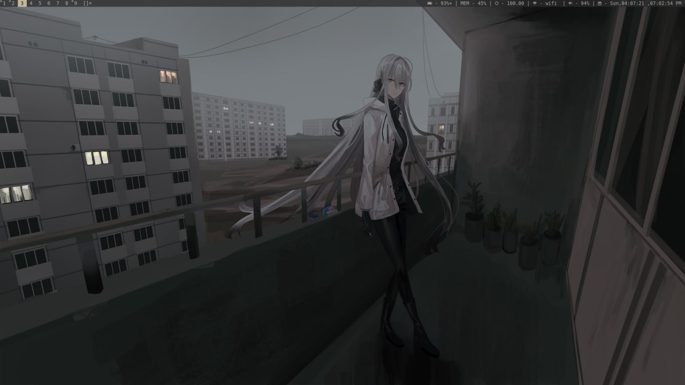
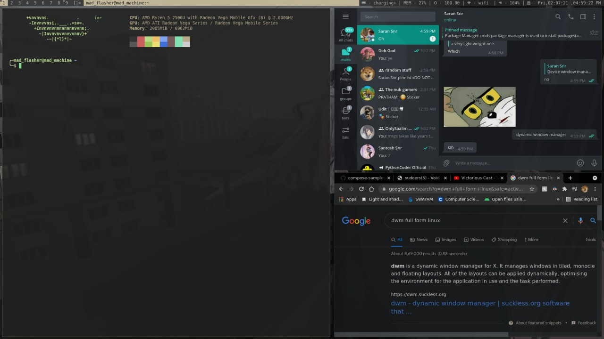
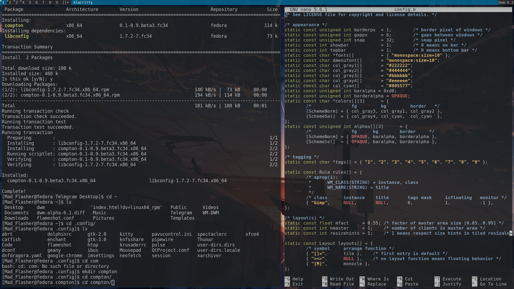

# MADWM
Madwm is a custom patched version of **DWM** its a fast and simple WM used in pair with **Void Linux** with so many usefull patches with [mad picom](https://github.com/MadFlasheroo7/mad-picom) (patched fork of picom to work well with my setup).

# Patches
- alpha
- full gaps
- bar padding
- pywall
- xrdb resources

# Requierments
In order to build dwm you need the Xlib header files.

# Installation
- Edit config.mk to match your local setup
- Change to dwm dir and run 
```shell
make clean install
```
- Write the following line in *.xinitrc* or copy config from [configs](https://github.com/MadFlasheroo7/configs)
```shell
exec dwm
```
> Note - Every time you change config.h you need to recompile source code.

# Screenshots
These are the only screenshots i could find :( 
|1|2|
|---|---|
|||

|old|
|---|
||